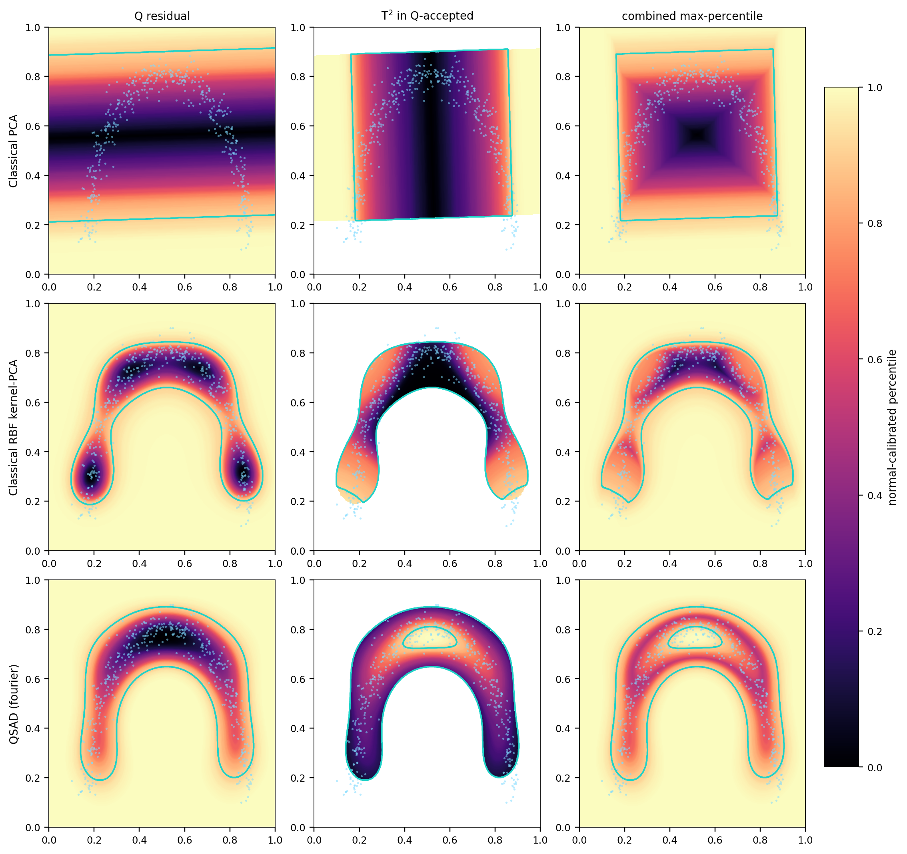
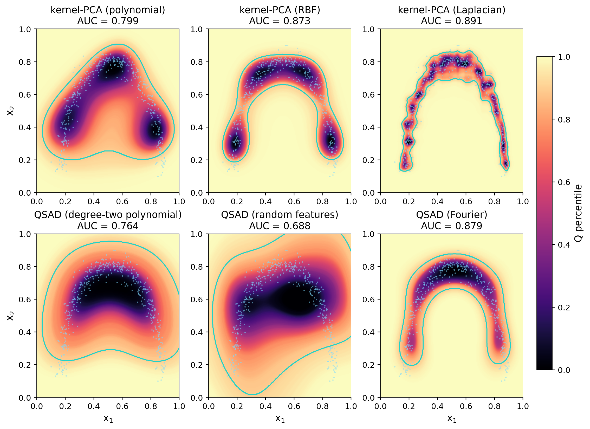
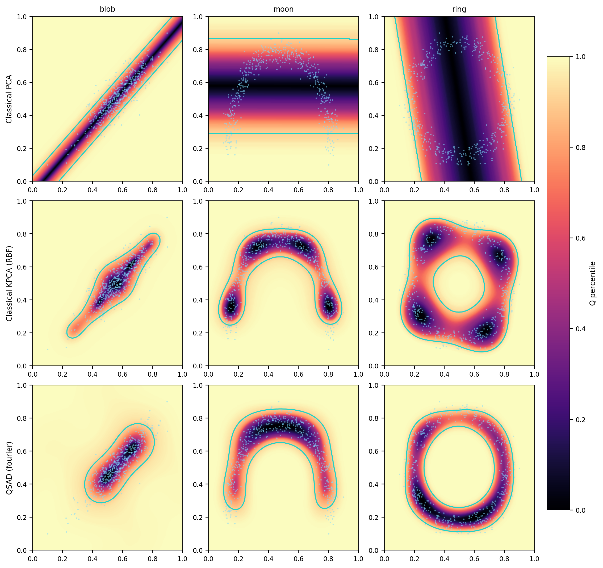
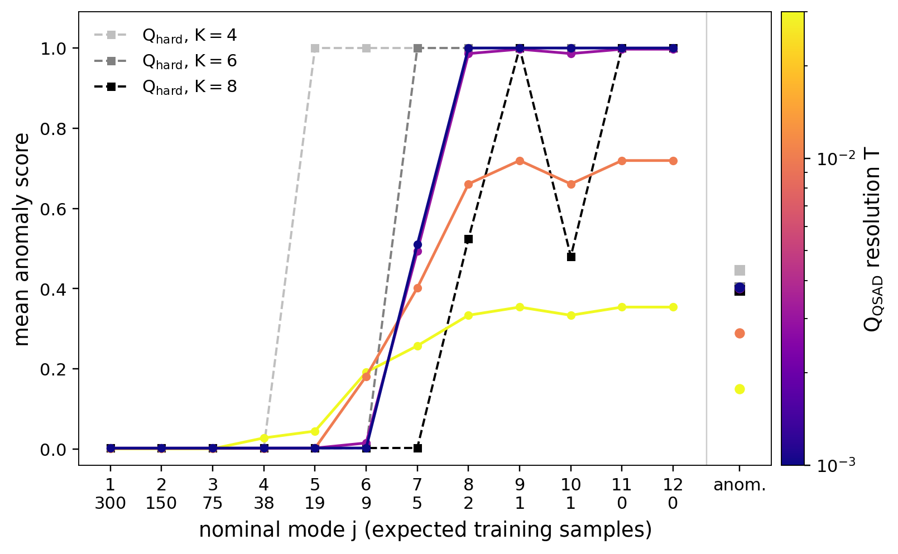

# Quantum Spectral Anomaly Detection (QSAD)

Numerical experiments for **QSAD**, a measurement-based one-class anomaly
detector that learns soft spectral tests from a nominal operator `C` and
produces quantum analogues of the classical PCA monitoring statistics:

- **`Q`** — residual support score, `Q = 1 − Tr(M σ)` (does the input leave the
  nominal subspace?)
- **`T²`** — shell-resolved Hotelling leverage (is the input atypical *within*
  the retained subspace?)

The detector is the **Regularized Spectral Detector**

```
M^f_{μ,T} = f( (C − μ I) / T ) = Σ_j f( (λ_j − μ) / T ) |u_j⟩⟨u_j|
```

where `f` is a smooth monotone response (Gaussian/probit `Φ` by default, or
logistic), `T` is the spectral resolution, and the threshold `μ` is calibrated
so the retained nominal mass `R(μ) = Tr(C M)` hits a target `α` (the quantum
analogue of an explained-variance level).

## Repository layout

```
src/qsad/
  core/      responses · detector · statistics (Q, T²) · classical_pca · kernel_pca · calibration
  models/    datasets (blob/moon/ring) · encodings (6 feature maps) · spin_chains (TFIM)
  viz/       shared style · figure builders
scripts/     run_experiment_A.py · run_experiment_B.py · run_kernel_encoding_comparison.py · run_dataset_comparison.py · run_centering_check.py
figures/     generated figures
results/     generated tables (CSV)
```

The core math engine (`qsad.core`) is independent of data generation
(`qsad.models`) and plotting (`qsad.viz`); the scripts only orchestrate.

## Installation

```bash
pip install -e .          # then `import qsad` works anywhere
# or, without installing:
pip install -r requirements.txt
PYTHONPATH=src python scripts/run_experiment_A.py
```

Requires Python ≥ 3.10 with numpy, scipy, scikit-learn, matplotlib. On a
headless machine, set `MPLBACKEND=Agg`.

## Experiments

### A — Curved boundaries (classical data via quantum feature states)

```bash
python scripts/run_experiment_A.py                  # the 3x3 headline grid
python scripts/run_kernel_encoding_comparison.py    # classical kernels vs QSAD maps
python scripts/run_dataset_comparison.py            # PCA vs kernel-PCA vs QSAD
python scripts/run_centering_check.py               # input-centering sensitivity
```

A one-class moon cloud in `[0,1]²` is embedded into a quantum feature state. The
3×3 headline grid (rows: linear **Classical PCA**, the standard **centered RBF
kernel-PCA** baseline, and **QSAD** with a four-qubit Fourier feature map;
columns: `Q` residual, `T²` leverage, combined) shows linear PCA giving a rigid
straight band, while both nonlinear methods produce curved acceptance regions
that follow the data. QSAD on classical data *is* a kernel method, so this is a
**consistency check**, not an accuracy claim: the `Q` boundaries agree across
methods, while the `T²` panels are kernel-specific (the RBF and Fourier maps
weight different within-support directions).



**Encodings** (`qsad.models.encodings`, all swappable): `poly_amplitude`,
`angle`, `iqp`, `poly2`, `fourier`, `rff_gaussian`. The `fourier` map is used in
the headline grid as a fixed representative, not as the winner of an encoding
search. Kernel choice is data-dependent for classical and quantum methods alike:
`run_kernel_encoding_comparison.py` puts three classical kernel-PCA baselines
(polynomial, RBF, Laplacian) next to three QSAD maps (`poly2`, `rff_gaussian`,
`fourier`) on the moon — no kernel wins everywhere, a suitable quantum map
adapts to the geometry the way a suitable classical kernel does, and the
polynomial kernel is mediocre on both sides.



**Centering**: linear PCA and the kernel baselines center in the standard way
(input mean / Gram double-centering). Re-centering the raw inputs with the
training mean before the kernels or maps is immaterial for the shift-invariant
kernels and small for the polynomial ones — `run_centering_check.py`
reproduces the sensitivity table.

**Datasets** (`qsad.models.datasets`): a fairness suite spanning linear PCA's
range — `gaussian_blob` (PCA-friendly), `moon` (curved), `ring` (PCA fails: its
slab runs through the empty centre).

**Fair baseline — read this before quoting Experiment A.** On classical data
QSAD *is* a kernel method, so the honest comparison is not linear PCA alone but
a classical kernel-PCA with a matched kernel. `run_dataset_comparison.py` adds
an RBF kernel-PCA novelty baseline:



| dataset | Classical PCA (linear) | Classical KPCA (RBF) | QSAD (fourier) |
|---|---|---|---|
| blob | 0.89 | 0.93 | 0.93 |
| moon | 0.66 | 0.87 | 0.88 |
| ring | 0.57 | 0.82 | 0.88 |

Linear PCA is insufficient on curved/closed geometries; a strong *classical*
kernel method handles them, and QSAD only reaches **parity** with it. We make
**no classical-data accuracy claim** — Experiment A is a kernel-PCA sanity
check. In fact QSAD with `rff_gaussian` *converges* to classical RBF kernel-PCA
as the encoding grows (ring Spearman corr 0.75 → 0.87 → 0.93 at 4 → 6 → 8
qubits, with the median-heuristic bandwidth): the lift is the kernel, available
classically too. QSAD's actual
contribution is the quantum measurement **access model** and **quantum-native
data** (Experiment B).

### B — Quantum-native data (TFIM, a phase transition)

```bash
python scripts/run_experiment_B.py
```

The data are genuinely quantum states, with no classical embedding. The nominal
source populates the low-energy ladder of an ordered-phase transverse-field
Ising model (`n = 10` spins, `h_A = 0.4`) with **geometrically decreasing
weights** `w_j ∝ 2^-j` over `M = 12` modes — a thermal-like occupation, so the
nominal spectrum is *graded* and crosses the `1/N` sampling resolution inside
the ladder: there are modes with hundreds of training samples, a handful, one,
and none, and **no spectral gap singles out a "correct" rank `K`** (the
explained-variance rule maps `α ∈ [0.95, 0.995]` to `K = 5…8`). Anomalies are
states from the **paramagnetic phase** just past the critical point
(`h_B = 1.2`, deliberately stringent).

**Soft vs hard, the point of the experiment.** A hard top-`K` projector is
binary: the rare-but-valid 1.6% mode (9 training samples) is scored *fully
anomalous* at `K = 4` (mean `1.00` — above the anomaly itself at `0.45`) and
*fully normal* at `K = 6` (`0.00`); past the sampling floor (`K = 8`) the
estimated eigenvectors mix and the hard score mislabels modes erratically. The
calibrated soft detector — one retained-mass target `α = 0.99`, no rank choice
— grades the same ladder monotonically (rare mode `0.02`, anomaly `0.40` at
`T = 3e-3`) and reaches AUC `0.990`, within half a point of the best
a-posteriori rank (`0.995`, `K ≥ 8`) and far above low ranks (`0.94` at `K = 4`,
`0.76` at `K = 2`).

| figure | what it shows |
|---|---|
| `experiment_B_spectrum.png`            | the graded nominal spectrum crossing `1/N`, the hard cutoff `K(α) = 7`, and the soft occupations that weight the tail instead of cutting it |
| `experiment_B_mode_profile.png`        | mean score per nominal mode: hard `K` flips whole valid modes 0 → 1 (and zigzags past the sampling floor); soft grades them by rarity |
| `experiment_B_sectors_temperature.png` | dominant / rare / anomaly sectors: `Q_raw` *and* hard `K = 4` invert rare vs anomaly; soft keeps the rare sector below the anomaly |
| `experiment_B_temperature_sweep.png`   | `Q` vs field `h` at several `T` — rises across the critical point; converges to the hard projector at `K(α)` as `T → 0` |
| `experiment_B_auc_vs_T.png`            | detection AUC vs `T` at finite shots — small `T` is shot-robust; `T` larger than the tail spacing degrades even at `∞` shots |



**Resolution choice.** `T` must resolve the spectral scale of the graded tail
(too-large `T` over-retains it), while smaller `T` costs nothing here and is
more robust to measurement-shot noise — the two sides of the resolution knob.
Detection tracks the quantum phase transition with no order parameter supplied.
(`run_experiment_B.py` also writes `experiment_B_auc.csv` with the full
detector × AUC table.)

## Reference

See `Qsad1.tex` for the full theoretical framework (the detector derivation,
calibration protocols, and sharp-limit correspondence with classical `Q`/`T²`).
