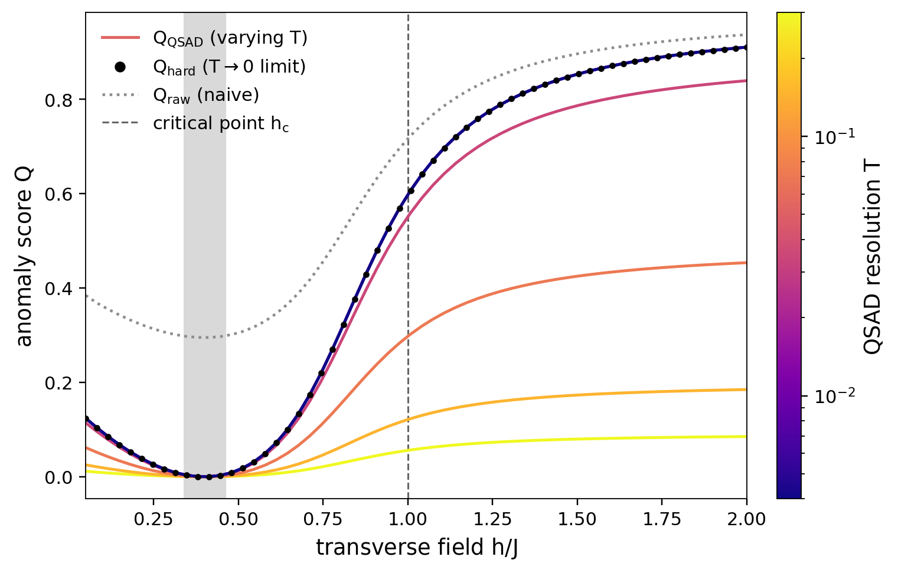

# Quantum Spectral Anomaly Detection (QSAD)

Numerical experiments for **QSAD**, a measurement-based one-class anomaly
detector that learns soft spectral tests from a nominal operator `C` and
produces quantum analogues of the classical PCA monitoring statistics:

- **`Q`** — residual support score, `Q = 1 − Tr(M σ)` (does the input leave the
  nominal subspace?)
- **`T²`** — shell-resolved Hotelling leverage (is the input atypical *within*
  the retained subspace?)

The detector is the **Regularized Spectral Detector**

```
M^f_{μ,T} = f( (C − μ I) / T ) = Σ_j f( (λ_j − μ) / T ) |u_j⟩⟨u_j|
```

where `f` is a smooth monotone response (Gaussian/probit `Φ` by default, or
logistic), `T` is the spectral resolution, and the threshold `μ` is calibrated
so the retained nominal mass `R(μ) = Tr(C M)` hits a target `α` (the quantum
analogue of an explained-variance level).

## Repository layout

```
src/qsad/
  core/      responses · detector · statistics (Q, T²) · classical_pca · kernel_pca · calibration
  models/    datasets (blob/moon/ring) · encodings (6 feature maps) · spin_chains (TFIM)
  viz/       shared style · figure builders
scripts/     run_experiment_A.py · run_experiment_B.py · run_encoding_comparison.py · run_dataset_comparison.py
figures/     generated figures
results/     generated tables (CSV)
```

The core math engine (`qsad.core`) is independent of data generation
(`qsad.models`) and plotting (`qsad.viz`); the scripts only orchestrate.

## Installation

```bash
pip install -e .          # then `import qsad` works anywhere
# or, without installing:
pip install -r requirements.txt
PYTHONPATH=src python scripts/run_experiment_A.py
```

Requires Python ≥ 3.10 with numpy, scipy, scikit-learn, matplotlib. On a
headless machine, set `MPLBACKEND=Agg`.

## Experiments

### A — Curved boundaries (classical data via quantum feature states)

```bash
python scripts/run_experiment_A.py            # the 3x3 headline grid
python scripts/run_encoding_comparison.py     # 6 feature maps on one dataset
python scripts/run_dataset_comparison.py      # PCA vs kernel-PCA vs QSAD
```

A one-class moon cloud in `[0,1]²` is embedded into a quantum feature state. The
3×3 headline grid (rows: linear **Classical PCA**, the standard **centered RBF
kernel-PCA** baseline, and **QSAD** with a four-qubit Fourier feature map;
columns: `Q` residual, `T²` leverage, combined) shows linear PCA giving a rigid
straight band, while both nonlinear methods produce curved acceptance regions
that follow the data. QSAD on classical data *is* a kernel method, so this is a
**consistency check**, not an accuracy claim: the `Q` boundaries agree across
methods, while the `T²` panels are kernel-specific (the RBF and Fourier maps
weight different within-support directions).


**Encodings** (`qsad.models.encodings`, all swappable): `poly_amplitude`,
`angle`, `iqp`, `poly2`, `fourier`, `rff_gaussian`. The `fourier` map gives the
cleanest boundary and the highest AUC; `iqp` is expressive but fragmented.

**Datasets** (`qsad.models.datasets`): a fairness suite spanning linear PCA's
range — `gaussian_blob` (PCA-friendly), `moon` (curved), `ring` (PCA fails: its
slab runs through the empty centre).

**Fair baseline — read this before quoting Experiment A.** On classical data
QSAD *is* a kernel method, so the honest comparison is not linear PCA alone but
a classical kernel-PCA with a matched kernel. `run_dataset_comparison.py` adds
an RBF kernel-PCA novelty baseline:


| dataset | Classical PCA (linear) | Classical KPCA (RBF) | QSAD (fourier) |
|---|---|---|---|
| blob | 0.89 | 0.93 | 0.93 |
| moon | 0.66 | 0.87 | 0.88 |
| ring | 0.57 | 0.82 | 0.88 |

Linear PCA is insufficient on curved/closed geometries; a strong *classical*
kernel method handles them, and QSAD only reaches **parity** with it. We make
**no classical-data accuracy claim** — Experiment A is a kernel-PCA sanity
check. In fact QSAD with `rff_gaussian` *converges* to classical RBF kernel-PCA
as the encoding grows (ring Spearman corr 0.75 → 0.87 → 0.93 at 4 → 6 → 8
qubits, with the median-heuristic bandwidth): the lift is the kernel, available
classically too. QSAD's actual
contribution is the quantum measurement **access model** and **quantum-native
data** (Experiment B).

### B — Quantum-native data (TFIM, a phase transition)

```bash
python scripts/run_experiment_B.py
```

The data are genuinely quantum states, with no classical embedding. The nominal
source is a 70/20/10 mixture of the low-energy eigenstates of a transverse-field
Ising model (`n = 8` and `10` spins; figures for `n = 10`) deep in the **ordered
phase** (`h_A = 0.4`); anomalies are states from the **paramagnetic phase** just
past the critical point (`h_B = 1.2`, a deliberately stringent near-critical
anomaly). The nominal mixture eigenvalues recover the mode weights
(`≈ 0.70, 0.19, 0.10`).

**Softness is a feature, not an approximation.** QSAD is calibrated by a single
retained-mass target `α = 0.99` at a soft resolution; `T` is a tunable knob, and
`T → 0` recovers the hard spectral projector but is *not* a preferred operating
point.

| figure | what it shows |
|---|---|
| `experiment_B_temperature_sweep.png`   | `Q` vs field `h` at several `T` — rises across the critical point; the soft family converges to the hard projector `Q_hard` as `T → 0` |
| `experiment_B_sectors_temperature.png` | per-sector scores (`Q_raw` vs `Q_QSAD` at several `T`): naive `Q_raw` flags the rare-but-valid sector, QSAD keeps it nominal |
| `experiment_B_auc_vs_T.png`            | detection AUC vs `T` at finite measurement shots — a sharper (small-`T`) detector is far more shot-robust |



**Key result.** Density-weighted `Q_raw` over-penalizes the rare-but-valid nominal
sector (mean score `0.90`, which even *exceeds* the near-critical anomaly at
`0.85`), so it would rank a valid state as more anomalous than the anomaly. The
calibrated `Q_QSAD` keeps the rare sector nominal (`0.08`) while flagging the
anomaly, at every `T`, and detection tracks the quantum phase transition with no
order parameter supplied. (`run_experiment_B.py` also emits the simpler single-`T`
`experiment_B_sweep.png`, `experiment_B_sectors.png`, `experiment_B_roc.png`, and
`experiment_B_auc.csv`.)

## Reference

See `Qsad1.tex` for the full theoretical framework (the detector derivation,
calibration protocols, and sharp-limit correspondence with classical `Q`/`T²`).
